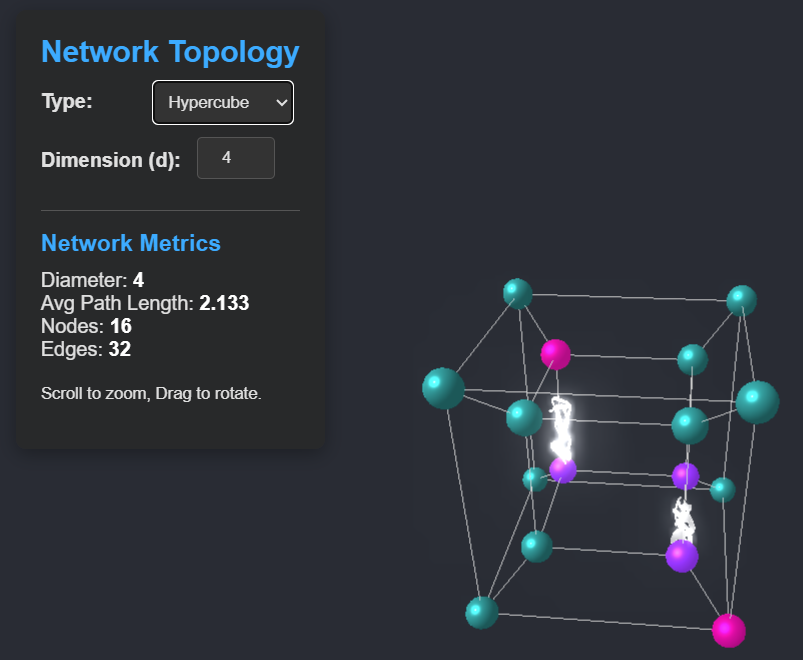

# Topology Visualizer

This project is a web-based application that visualizes different network topologies (like
rings and meshes) and calculates their key graph metrics. It uses Three.js for 3D
rendering and provides an interactive interface to explore various graph structures.

You can check out the live demo of the application
[here](https://jentrialgo.github.io/topo_visualizer/).

## Features

*   **Topology Generation:**
    *   Generates ring, mesh, and hypercube topologies.
    *   Ring topology supports adjustable "skip" distances to create more complex ring variations.
    *   Mesh topology supports adjustable rows and columns.
*   **Interactive Visualization:**
    *   Uses Three.js for 3D rendering of nodes and edges.
    *   Orbit controls allow users to rotate, pan, and zoom the view.
    *   Nodes are represented as spheres, and edges as lines.
*   **Network Metrics Calculation:**
    *   Calculates and displays the following metrics:
        *   **Diameter:** The longest shortest path between any two nodes in the graph.
        *   **Average Path Length:** The average of the shortest paths between all pairs of nodes.
        *   **Node Count:** The total number of nodes in the graph.
        *   **Edge Count:** The total number of edges in the graph.
    *   Handles disconnected graphs, indicating "Disconnected" for diameter and average path length.
*   **Dynamic UI:**
    *   Dynamically updates input fields based on the selected topology type.
    *   Validates user input and provides fallback values if necessary.
    *   Clears the previous graph visualization when a new one is generated.
* **Responsive Design:**
    * The visualization adapts to the size of the browser window.

## Technologies Used

*   **Three.js:** A JavaScript library for creating and displaying animated 3D computer graphics in a web browser.
*   **HTML:** For the structure of the user interface.
*   **CSS:** For styling the user interface.
*   **JavaScript:** For the application logic, graph generation, metric calculation, and
    visualization.
* **OrbitControls:** For the user to interact with the 3D scene.

## How to Use

1.  **Open the HTML file:** Open the `index.html` file.
2.  **Select a Topology:** Choose a topology type from the dropdown menu (e.g., "ring" or
    "mesh").
3.  **Adjust Parameters:** Modify the parameters for the selected topology (e.g., number
    of nodes, rows, columns, skip distance).
4.  **Generate Graph:** Click the "Generate" button to create the graph and visualize it.
5.  **Explore:** Use your mouse to interact with the 3D visualization:
    *   **Rotate:** Click and drag.
    *   **Pan:** Right-click and drag (or Ctrl + click and drag).
    *   **Zoom:** Scroll the mouse wheel.
6.  **View Metrics:** The calculated network metrics (diameter, average path length, node
    count, edge count) will be displayed below the visualization.

## Project Structure

*   **`index.html`:** The HTML file that contains the basic structure of the page,
    including the container for the 3D scene, the dropdown menu, the input fields, the
    generate button, and the metrics display.
*   **`style.css`:** The CSS file that contains the styles for the page.
*   **`main.js`:** Contains the core JavaScript code for the application, including:
    *   Three.js setup and rendering.
    *   UI event handling.
    *   Graph generation functions (e.g., `generateRing`, `generateMesh`).
    *   Metric calculation functions (e.g., `calculateGraphMetrics`, `bfs`).
    *   Visualization functions (e.g., `visualizeGraph`, `clearVisualization`).

## Development Notes

*   **Extensibility:** The code is designed to be extensible to other topology types. You
    can add new `generate...` functions and update the `updateParameterInputs` and
    `generateGraphAndMetrics` functions to support them.
*   **Layout:** The `visualizeGraph` function uses simple layouts for ring and mesh
    topologies. More sophisticated layouts (e.g., force-directed) could be implemented for
    other topologies or as a fallback.
*   **Error Handling:** The code includes basic error handling for invalid user input and
    disconnected graphs.
*   **Performance:** For very large graphs, performance could be improved by optimizing
    the rendering and metric calculation.

## License

MIT License
